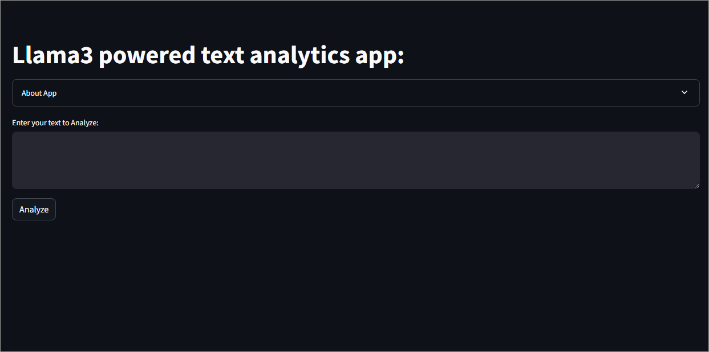
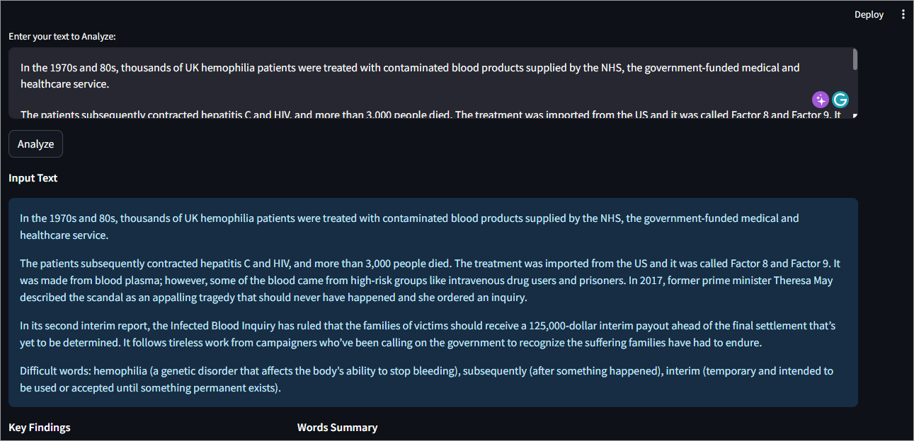
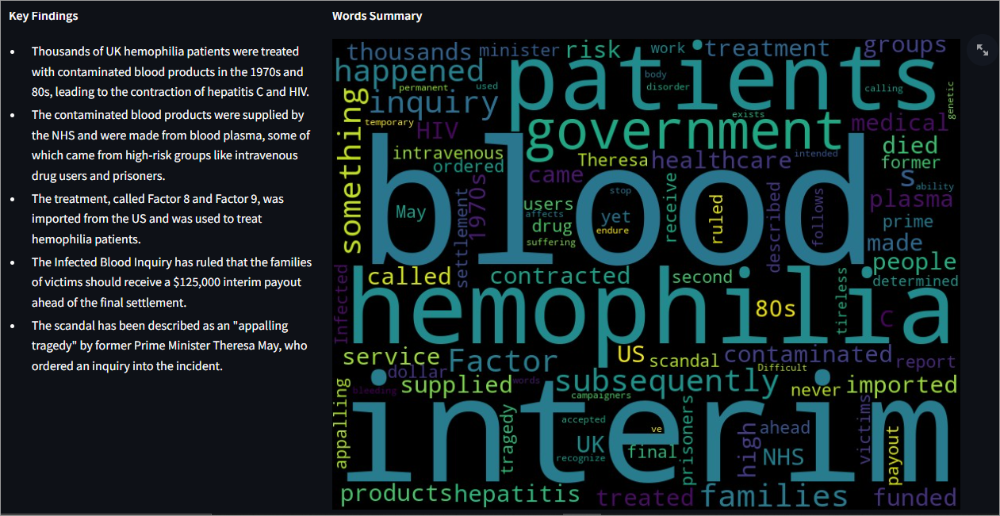

# 🔍 Llama3 Powered Text Analytics App 🔍

## **About App** 🤔

This app is built with ❤️ Llama3-70b, 🌊 Streamlit, and 📚 Spacy, providing a powerful text analytics platform.

## **Features** 🎉

- **Key Findings** 📝: Extract key insights from your text in 5 bullet points or less.
- **Words Summary** 🌫️: Generate a word cloud summary of your text.
- **Named Entity Recognition** 👥: Identify and visualize named entities in your text.

## **Getting Started** 🚀

1️⃣ Enter your text to analyze in the input field.
2️⃣ Click the "Analyze" button to generate key findings, words summary, and named entity recognition.

## **Technical Details** 🤖

- Built with ❤️ Llama3-70b, 🌊 Streamlit, and 📚 Spacy.
- Utilizes the 📈 Groq API for key findings extraction.
- Leverages 📚 Spacy's NLP capabilities for named entity recognition.

## **Screenshots** 📸

<!-- [how to run]('D:\Toxity-Classifier-App\screen-1.png') -->
<!--  -->

## **Contributing** 🤝

Contributions are welcome! If you'd like to contribute to this project, please fork the repository and submit a pull request.

## **License** 📜

This project is licensed under the MIT License. See [LICENSE](LICENSE) for details.

## **Special Thanks** 🙏

- To the creators of Llama3-70b, Streamlit, and Spacy for their amazing work! 🙌
